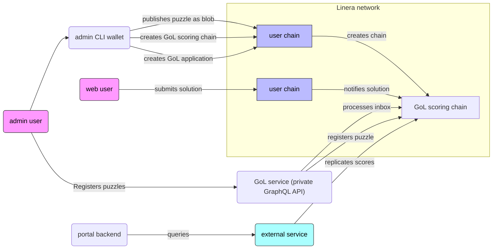

# Game-of-Life challenge

## Architecture overview

See also https://www.notion.so/Game-of-Life-Challenge-24ebf4cdba9c80c98a1ccb9fabf0db04



## Quickstart (backend)

```ignore
cargo install linera-storage-service@0.15.3 linera-service@0.15.3

cargo build --release --target wasm32-unknown-unknown

cargo run --bin gol -- create-puzzles

bash -e -x <(linera extract-script-from-markdown backend/README.md)
```

## Testing scores against the production app

Run the commands below using `bash -e -x <(linera extract-script-from-markdown README.md)`.

```bash
# Production app
APP_ID="27145fa604adf9996647a9a2add1dafe8f80f1a547835edf62ee408cd8903dd3"

# Test user
MATHIEU_CLI="0x359C1a2203aE35adBFA85bC9C1EAB540bF8797a7"

# Scoring chain
CHAIN="e71636fde3a70cdbfdb7fd9bef6cb1ba632af8b0567b8f76df47b35489972dd3"

# Getting a chain and tracking the scores
FAUCET_URL=https://faucet.testnet-conway.linera.net

LINERA_TMP_DIR=$(mktemp -d)
export LINERA_WALLET="$LINERA_TMP_DIR/wallet.json"
export LINERA_KEYSTORE="$LINERA_TMP_DIR/keystore.json"
export LINERA_STORAGE="rocksdb:$LINERA_TMP_DIR/client.db"

linera wallet init --faucet $FAUCET_URL
linera wallet follow-chain $CHAIN

linera service --port 8080 &
```

```gql,uri=http://localhost:8080/chains/$CHAIN/applications/$APP_ID
query {
    reportedSolutions {
        entry(key: "$MATHIEU_CLI") {
            key
            value {
                entries(input: {}) {
                    key
                    value
                }
            }
        }
    }
}
```
