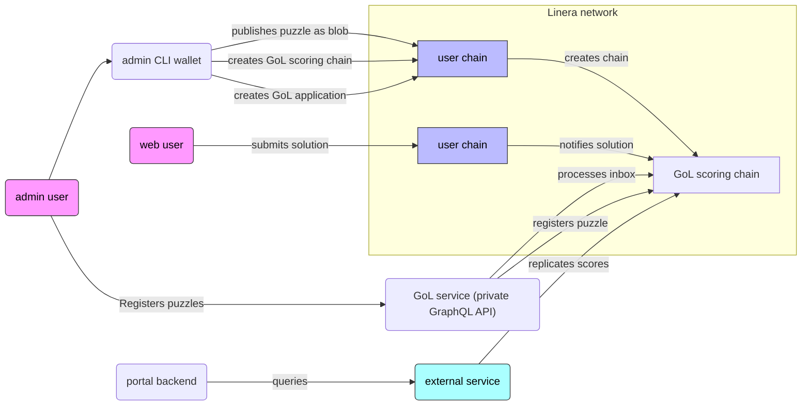

# Game-of-Life challenge

## Architecture overview

See also https://www.notion.so/Game-of-Life-Challenge-24ebf4cdba9c80c98a1ccb9fabf0db04



## Quickstart (backend)

```
cargo install linera-storage-service@0.15.3 linera-service@0.15.3

cargo build --release --target wasm32-unknown-unknown

cargo run --bin gol -- create-puzzles

linera extract-script-from-markdown backend/README.md | bash -ex
```
